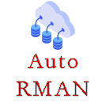
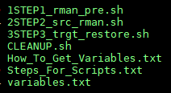

<!-- PROJECT SHIELDS -->
<!--
*** I'm using markdown "reference style" links for readability.
*** Reference links are enclosed in brackets [ ] instead of parentheses ( ).
*** See the bottom of this document for the declaration of the reference variables
*** for contributors-url, forks-url, etc. This is an optional, concise syntax you may use.
*** https://www.markdownguide.org/basic-syntax/#reference-style-links
-->

[![LinkedIn][linkedin-shield]](https://www.linkedin.com/in/noahhorner/)


<!-- PROJECT LOGO -->
<br />
<p align="center">
  <a href="https://github.com/lottolearn/rman_restore_automated">
    
  </a>

  <h3 align="center">Automated RMAN backup and restore to new host</h3>

  <p align="center">
    A collection of 45 scripts to automate a rman backup and restore migration between two hosts.
    <br />
    <a href="https://github.com/lottolearn/rman_restore_automated">View Demo</a>
  </p>
</p>


<!-- TABLE OF CONTENTS -->
## Table of Contents

* [About the Project](#about-the-project)
* [Built With](#built-with)
* [Getting Started](#getting-started)
* [Prerequisites](#prerequisites)
* [Installation](#installation)
* [Quick Run](#quick-run)
* [What Each Script Does](#What-Each-Script-Does)
* [License](#license)
* [Contact](#contact)
* [Acknowledgements](#acknowledgements)


<!-- ABOUT THE PROJECT -->
# About The Project



Hi, this is a collection of bash scripts designed to automate a rman and restore migration between two hosts on NFS. It's been thoroughly tested as working on 12.1. The general idea is that you have a **varibales text file that you must fill out**, and then the script sources that for the information.

There are four main scripts that the user runs, and the other ~40 are on the backend.


## Built With

* [BASH](https://tldp.org/LDP/Bash-Beginners-Guide/html/Bash-Beginners-Guide.html)

## Platform
* [Red Hat Enterprise Linux Server release 7.8 (Maipo)](https://access.redhat.com/)


<!-- GETTING STARTED -->
# Getting Started


## Prerequisites

You're going to need **two seperate database servers, and a shared NFS.**

I used **Oracle Cloud Infrastructure** to provision mine, so I would suggest using OCI.


## Installation

1. Download the ZIP from GitHub.

2. SFTP the files to your server's NAS.

3. Extract the files on your server.
```sh
mkdir -p -m 777 /tmp/fake/nfs
unzip RMAN_SCRIPTS.zip -d /tmp/fake/nfs
```
4. Verify all files are there, and the hidden .dontremove folder.
```sh
ls -ltra /to/see/hidden/folders
```


5. All done!


<!-- USAGE EXAMPLES -->
# Quick Run

First, you need to edit the variables.txt and fill out your information. You can refer to How_To_Get_Variables.txt.
```sh
# GETTING VARIABLES -:
# SOURCE WALLET LOCATION
# CAT SQLNET.ORA
# ENCRYPTION_WALLET_LOCATION
# NOTE SCRIPTS GRAB WALLET FROM SQLNET AUTO
# BUT JUST INCASE FAILS, GOOD TO REFERENCE
# FOR YOU WHEN YOU MANUALLY COPY

# GRAB DATABASE NAME / UNQ NAME
# env | grep ORACLE

# GRAB RECO (RUN ON TARGET)
#sho parameter db_recovery_file_dest

# GRAB DATA (RUN ON TARGET)
#sho parameter db_create_file_dest

# CHANGE SYS PASSWORD (BOTH SRC / TARGET)
#ALTER USER SYS IDENTIFIED BY [password];

# SHOW DOMAIN (RUN ON TARGET)
#sho parameter domain

# SHOW AUDIT LOCATION (RUN ON TARGET)
#sho parameter audit_file_dest

# SHOW PGA (RUN ON TARGET)
#sho parameter pga_aggregate_target

# SHOW SGA (RUN ON TARGET)
#sho parameter sga_target

# SHOW VERSION (RUN ON SOURCE)
#sho parameter compatible

# SHOW BLOCK SIZE (VERIFY BOTH SOURCE AND TARGET ARE SAME)
#sho parameter db_block_size
```


### Now, it's pretty basic... you just run scripts in this order.

1 First script (don't run in nohup)
```sh
./1STEP1_rman_pre.sh
```

2 Second script (ACTUAL RMAN BACKUP, RUN IN NOHUP)
```sh
nohup ./2STEP2_src_rman.sh &
hit enter again
tail -200f nohup.out
mv nohup.out nohup.out.backup
```

3 Third script (RESTORE AND RECOVERY RUN IN NOHUP)
```sh
nohup ./3STEP3_trgt_restore.sh &
hit enter again
tail -200f nohup.out
mv nohup.out nohup.out.restorereco
```

# What Each Script Does
## 1STEP1_rman_pre.sh
Use this space to show useful examples of how a project can be used. Additional screenshots, code examples and demos work well in this space. You may also link to more resources.

_For more examples, please refer to the [Documentation](https://example.com)_

```sh
npm install npm@latest -g
```


<!-- ROADMAP -->
## Roadmap

See the [open issues](https://github.com/lottolearn/rman_restore_automated/issues) for a list of proposed features (and known issues).


<!-- CONTRIBUTING -->
## Contributing

Contributions are what make the open source community such an amazing place to be learn, inspire, and create. Any contributions you make are **greatly appreciated**.

1. Fork the Project
2. Create your Feature Branch (`git checkout -b feature/AmazingFeature`)
3. Commit your Changes (`git commit -m 'Add some AmazingFeature'`)
4. Push to the Branch (`git push origin feature/AmazingFeature`)
5. Open a Pull Request


<!-- LICENSE -->
## License

Distributed under the MIT License. See `LICENSE` for more information.


<!-- CONTACT -->
## Contact

Your Name - [@twitter_handle](https://twitter.com/twitter_handle) - email

Project Link: [https://github.com/lottolearn/rman_restore_automated](https://github.com/lottolearn/rman_restore_automated)


<!-- ACKNOWLEDGEMENTS -->
## Acknowledgements

* []()
* []()
* []()


<!-- MARKDOWN LINKS & IMAGES -->
<!-- https://www.markdownguide.org/basic-syntax/#reference-style-links -->
[contributors-shield]: https://img.shields.io/github/contributors/lottolearn/repo.svg?style=flat-square
[contributors-url]: https://github.com/lottolearn/repo/graphs/contributors
[forks-shield]: https://img.shields.io/github/forks/lottolearn/repo.svg?style=flat-square
[forks-url]: https://github.com/lottolearn/repo/network/members
[stars-shield]: https://img.shields.io/github/stars/lottolearn/repo.svg?style=flat-square
[stars-url]: https://github.com/lottolearn/repo/stargazers
[issues-shield]: https://img.shields.io/github/issues/lottolearn/repo.svg?style=flat-square
[issues-url]: https://github.com/lottolearn/repo/issues
[license-shield]: https://img.shields.io/github/license/lottolearn/repo.svg?style=flat-square
[license-url]: https://github.com/lottolearn/repo/blob/master/LICENSE.txt
[linkedin-shield]: https://img.shields.io/badge/-LinkedIn-black.svg?style=flat-square&logo=linkedin&colorB=555
[linkedin-url]: https://linkedin.com/in/lottolearn
[product-screenshot]: images/screenshot.png
