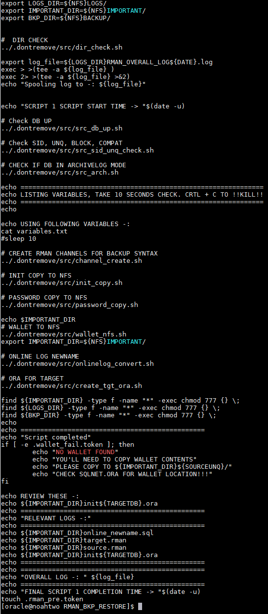

<!-- PROJECT SHIELDS -->
<!--
*** I'm using markdown "reference style" links for readability.
*** Reference links are enclosed in brackets [ ] instead of parentheses ( ).
*** See the bottom of this document for the declaration of the reference variables
*** for contributors-url, forks-url, etc. This is an optional, concise syntax you may use.
*** https://www.markdownguide.org/basic-syntax/#reference-style-links
-->

[![LinkedIn][linkedin-shield]](https://www.linkedin.com/in/noahhorner/)


<!-- PROJECT LOGO -->
<br />
<p align="center">
  <a href="https://github.com/lottolearn/rman_restore_automated">
    
  </a>

  <h3 align="center">Automated RMAN backup and restore to new host</h3>

  <p align="center">
    A collection of 45 scripts to automate a rman backup and restore migration between two hosts.
    <br />
    <a href="https://github.com/lottolearn/rman_restore_automated">View Demo</a>
  </p>
</p>


<!-- TABLE OF CONTENTS -->
## Table of Contents

* [About the Project](#about-the-project)
* [Built With](#built-with)
* [Getting Started](#getting-started)
* [Prerequisites](#prerequisites)
* [Installation](#installation)
* [Quick Run](#quick-run)
* [What Each Script Does](#What-Each-Script-Does)
  - [1STEP1_rman_pre.sh](#1STEP1_rman_presh)
  - [2STEP2_src_rman.sh](#2STEP2_src_rmansh)
  - [3STEP3_trgt_restore.sh](#3STEP3_trgt_restoresh)
* [Roadmap](#Roadmap)
* [License](#license)
* [Contact](#contact)


<!-- ABOUT THE PROJECT -->
# About The Project
[Top](#Table-of-Contents)


Hi, this is a collection of bash scripts designed to automate a rman and restore migration between two hosts on NFS. It's been thoroughly tested as working on 12.1. The general idea is that you have a **varibales text file that you must fill out**, and then the script sources that for the information.

There are four main scripts that the user runs, and the other ~40 are on the backend.


## Built With

* [BASH](https://tldp.org/LDP/Bash-Beginners-Guide/html/Bash-Beginners-Guide.html)
* [Red Hat Enterprise Linux Server release 7.8 (Maipo)](https://access.redhat.com/)
* Oracle Database 12c EE High Perf Release 12.2.0.1.0 - 64bit Production

_To learn more about RMAN, refer to Oracle's [Documentation](https://docs.oracle.com/cd/E11882_01/backup.112/e10642/rcmquick.htm#BRADV89346)_


<!-- GETTING STARTED -->
# Getting Started
[Top](#Table-of-Contents)

## Prerequisites

You're going to need **two seperate database servers, and a shared NFS.**

I used **Oracle Cloud Infrastructure** to provision mine, so I would suggest using OCI.


## Installation

1. Download the ZIP from GitHub.

2. SFTP the files to your server's NAS.

3. Extract the files on your server.
```sh
mkdir -p -m 777 /tmp/fake/nfs
unzip RMAN_SCRIPTS.zip -d /tmp/fake/nfs
```
4. Verify all files are there, and the hidden .dontremove folder.
```sh
ls -ltra /to/see/hidden/folders
```


5. All done!


<!-- USAGE EXAMPLES -->
# Quick Run
[Top](#Table-of-Contents)

First, you need to edit the variables.txt and fill out your information. You can refer to How_To_Get_Variables.txt.

### Where to find variables
```sh
# GETTING VARIABLES -:
# SOURCE WALLET LOCATION
# CAT SQLNET.ORA
# ENCRYPTION_WALLET_LOCATION
# NOTE SCRIPTS GRAB WALLET FROM SQLNET AUTO
# BUT JUST INCASE FAILS, GOOD TO REFERENCE
# FOR YOU WHEN YOU MANUALLY COPY

# GRAB DATABASE NAME / UNQ NAME
# env | grep ORACLE

# GRAB RECO (RUN ON TARGET)
#sho parameter db_recovery_file_dest

# GRAB DATA (RUN ON TARGET)
#sho parameter db_create_file_dest

# CHANGE SYS PASSWORD (BOTH SRC / TARGET)
#ALTER USER SYS IDENTIFIED BY [password];

# SHOW DOMAIN (RUN ON TARGET)
#sho parameter domain

# SHOW AUDIT LOCATION (RUN ON TARGET)
#sho parameter audit_file_dest

# SHOW PGA (RUN ON TARGET)
#sho parameter pga_aggregate_target

# SHOW SGA (RUN ON TARGET)
#sho parameter sga_target

# SHOW VERSION (RUN ON SOURCE)
#sho parameter compatible

# SHOW BLOCK SIZE (VERIFY BOTH SOURCE AND TARGET ARE SAME)
#sho parameter db_block_size
```


### Now, it's pretty basic... you just run scripts in this order.

1 First script (don't run in nohup)
```sh
./1STEP1_rman_pre.sh
```

2 Second script (ACTUAL RMAN BACKUP, RUN IN NOHUP)
```sh
nohup ./2STEP2_src_rman.sh &
hit enter again
tail -200f nohup.out
mv nohup.out nohup.out.backup
```

3 Third script (RESTORE AND RECOVERY RUN IN NOHUP)
```sh
nohup ./3STEP3_trgt_restore.sh &
hit enter again
tail -200f nohup.out
mv nohup.out nohup.out.restorereco
```

# What Each Script Does
[Top](#Table-of-Contents)

## All scripts have a token system
All of my scripts have a token system, which is why you should chmod -R 777 the whole folder you extract, that way there will be no write permission errors. Every script at the start adds a token, and removes as check. If it can't write, the scripts will not run as an error handler.

Each script also verifies you have the variables.txt file, because without it nothing will run. It creates a variables.txt from the template, just in case you somehow delete the file? I also use three main directories for the script process. LOGS_DIR, IMPORTANT_DIR, and BKP_DIR. Each of the three main scripts gets an overall log file you can review, and some components have separate log files (e.g. the BACKUP, RESTORE, RECO, etc...)

### What's the purpose of the token system?
Mainly error handling, I don't want you running the second script obviously, before the first -- because there will be no pre req steps done, and you won't get the important files you need for the backup, like allocating rman channels so the backup sets are named in an easily readable format.

The token system in the first 2 scripts for source don’t utilize it too much, the main token being you can’t run script 2 before 1. The reason for this is because I didn’t want to dive too deep into the token system, since the first script runs really quick, so if there’s any issues you can easily just restart. 

The token system is heavily utilized on the target side, because if you run into any issues, you’re going to have a bad time. The target shell database can always easily be dropped, but don’t include backups because it will clear the NFS. We’ll dive into this later, don’t worry if it sounds confusing now.

### Varibles check, and log, important, and backup directories

#### Variables check
Self-explanatory, this just checks at the start of each script as I said above. Once again, without this nothing will run. Make sure it's correctly filled out, refer to above under [Where to find variables](#Where-to-find-variables)

#### LOG Directory
This is where all logs will go, including the three major logs that get added each time you run a script. For the LOG directory, when you run ./CLEANUP.sh it will always take a backup of the LOG directory, so you can use it to reference. It may be spammy if you’re just running the first script only during testing, so may be wise to delete some.

#### IMPORTANT Directory
This is where, wait for it, all important files will go. This includes thing like channels we’ll be allocating for RMAN, the init.ora file we’ll use for restore… wallet files, password file, etc… without this restore will fail, miserably. It should always get created, once again if it doesn’t it will be a permission issue. Permissions are the biggest hinderance in determining if the scripts will work, or fail.

#### BACKUP Directory
This is where all the backup files from source will get added, as well as the control file backup. Restore will read from this directory, there shouldn’t be any issues, unless once again there’s permission issues. These should automatically get chmod 777 permission once script 2 finishes.

#### CLEANUP.sh script
This cleans up everything, and takes a backup of the logs directory. 

#### EXAMPLE DIRECTORIES (WITH A CLEANUP RAN, AND SCRIPT 1 RAN AGAIN)


## 1STEP1_rman_pre.sh
[Top](#Table-of-Contents)



### ../.dontremove/src/src_db_up.sh
This checks if the database is up. The source database must be up, otherwise it cannot continue

### ../.dontremove/src/src_sid_unq_check.sh
This is a failsafe, that verifies $ORACLE_SID, and $ORACLE_UNQNAME via SQL queries. Variables.txt must match, or it will never pass.

### ../.dontremove/src/src_arch.sh
This checks if the database is in archive log mode. For RMAN to continue, it must be.

### cat variables.txt
This gives you 10 seconds to visually verify your variables.txt look correct. CTRL + C if they aren’t.

### ../.dontremove/src/channel_create.sh
This script creates the RMAN channels allocation (.rman) for source and target. Target will just be allocated without syntax, but source will be given a BACKUP syntax format.

### ../.dontremove/src/init_copy.sh
This copies the current spfile into pfile format in our IMPORTANT directory.

### ../.dontremove/src/password_copy.sh
This copies the orapw file into our IMPORTANT directory for our restore to be successful encryption wise.

### ../.dontremove/src/wallet_nfs.sh
This is similar to above, but actually copies the cwallet and ewallet files to our IMPORTANT directory.

### ../.dontremove/src/onlinelog_convert.sh
This will run a SQL script to grab the online log newnames to both +DATA and +RECO if multiplex exists for online logs, if not will usually just send them to +DATA depending on your ASM location.

### ../.dontremove/src/create_tgt_ora.sh
This is the final step in script 1, it creates the init.ora file we’ll need for restore based off some SQL queries. It grabs the important stuff only, not the whole pfile.

### Final thoughts
As you can see, this can be a fast script to run which is why there’s minimal error handling.


## 2STEP2_src_rman.sh
[Top](#Table-of-Contents)


### Tokens
Only token it takes is **.rman_pre.token** to verify script 1 was ran.

###  ../.dontremove/src/src_checks_prebkp.sh
This script is similar to ../.dontremove/src/src_sid_unq_check.sh but it just checks SID and unique name from SQL queries.

### ../.dontremove/src/src_2_arch_check.sh
Similar to script one, just verifies via SQL query source is in ARCHIVELOG mode

### ../.dontremove/src/src_grab_scn_seq.sh
Grabs our SCN before backup to reference, stores in a txt file named grabbed_variables.txt in IMPORTANT directory along with other things we’ll go over.

### ../.dontremove/src/rman_list_config.sh
This shows the RMAN config on source so you can compare manually with target once restore and recovery is done.

### ../.dontremove/src/src_full_bak_compressed.sh
This is the actual backup script. It’s going to backup as **BACKUP AS COMPRESSED BACKUPSET DATABASE PLUS ARCHIVELOG**, and use our .rman script we allocated from script 1. It’s also using the **NOCFAU clause**, because we want to backup the control file separately AFTER backup is done (to avoid SCN issues.) This script is timed, so you can see how long the backup took in minutes.

### ../.dontremove/src/src_postbkp_scn.sh
This sends our post backup SCN to grabbed_variables.txt, if we need to reference one to restore to. Currently, we do not – but feature can be added in future development if needed. 

### ../.dontremove/src/src_bkp_ctrl_postbk.sh
This is the control file backup. We want to take it post backup and post backup SCN so we avoid and SCN / Sequence number issues on restore. I think it’s important to do this step after, because I’ve ran into issues when the backup didn’t have NOCFAU clause, and control file backup was taken before the backup hit, and archive logs were somehow added during backup not in the SCN of the control file before.

### ../.dontremove/src/src_ora_grab.sh
This runs SQL scripts to grab some variables for grabbed_variables.txt. Grabs things like compatible, enable_pluggable_database, db_block_size, and timezone_file.


## 3STEP3_trgt_restore.sh
[Top](#Table-of-Contents)


### Tokens
This is the script that utilizes A LOT more tokens, each script has a failsafe.
```sh
.rman_bak_done.token -> Checks for source backup.
.src_control.token -> Checks for source controlfile backup
.overall_script2.token -> Checks overall script 2 was ran.
.TRGT_WALLY_NOT_AUTOLOGIN.token -> checks if target is not open autologin (means source wallet wasn’t brought over)
.pfile_fail_fix.token -> this means the pfile failed to startup on the target side.
.CNTRL_FAIL_RESTORE.token -> this means the control file restore in RMAN on target side failed.
.RMAN_REST_FAIL.token -> this means the overall restore on target side failed… not good. Will try one more time, but if fails everything needs to be redone.
.NAS_TRGT_CHECK.token -> This checks that everything was brought over into the NAS related to wallet, pfile, and password file. If not, you’ll have to manually do it and then it will pass this check.
.TRGT_WALLY_IS_OA.token -> This will check for open autologin, if not will issue the .TRGT_WALLY_NOT_AUTOLOGIN.token above until fixed. Once fixed and open autologin, script 3 can continue. Make sure you actually take the source wallet though or restore will fail with decrypt issues.
.PFP_NO_DBD_CHECK.token -> Checks if the database is down. The target database must be down, and it must be empty. Empty meaning you should have dropped the database and cleaned ASM if you provisioned on OCI. It should only have the binaries.
.PFP_NO_DBD_CHECK.token -> This checks the pfile startup and spfile create. If it fails, will issue the .pfile_fail_fix.token above. Once you fix the init.ora file and can startup from it, shutdown database and it will resume script 3.
.CNTRL_PASS_RESTORE.token -> once spfile passes, this token exists to give permission to run the check on the database to see if it’s mounted. If mounted, issues .DBISMOUNTED.token
.DBISMOUNTED.token -> this is needed to add the online log converts via a SQL statement. Once it runs them, it will issue .ONLINELOG.token
.ONLINELOG.token -> once this is issued, it will allow the .RMAN_PRE_RESTORE_GOOD.token to be checked.
.RMAN_PRE_RESTORE_GOOD.token -> This runs a check that can see if the database restore has all necessary backup sets and will run. If the script check completes, it will issue said .RMAN_PRE_RESTORE_GOOD.token
.RESTORE_IS_PASS.token -> This is the actual restore, it will only run if .RESTORE_IS_PASS.token is issued. If it passes, will issue .PFILE_2_ASM_GOOD.token.
.PFILE_2_ASM_GOOD.token -> This is issued when the spfile was successfully moved to ASM post restore. If successful, it means we can move on.
.DB_RECO_DONE.token -> This will be ran if spfile is moved, this is our final step before we reset logs and open the database. It just runs a recovery. You will see ORA errors related to unknown archived log but this is okay. Will then create .RESTORE_IS_PASS.token
.DB_RECO_DONE.token -> This is the second to last token. It just said the recovery is done, and we can reset logs and open the database. It sends the last token that gives us the okay to open the database and reset logs, which is the final step.
```
As you can see, it has a bunch of failchecks so most of the time if one fails, you can run the whole script again and it'll skip steps, and get to a stop on the failed part and check if it has passed.

### ../.dontremove/trgt/trgt_oracle_env_check.sh
Just verifies the ORACLE_SID and ORACLE_UNQNAME

### ../.dontremove/trgt/trgt_pw_pfile_nas_copy.sh
This copies the password file, and pfile from NFS to the $ORACLE_HOME/dbs folder.

### ../.dontremove/trgt/trgt_db_down.sh
This copies the wallet, I made a separate script for error handling because this is an important step, and can easily be done manually if failed.

### ../.dontremove/trgt/trgt_check_pandsp.sh
Checks if the pfile will start, and creates. Will always check if database is idle until this step passes and token .PFP_NO_DBD_CHECK.token is created.

### ../.dontremove/trgt/trg_check_up_nomount.sh
It will not check if the database is up, and not mounted instead of idle. Will always pass if spfile was successful, though.

### ../.dontremove/trgt/trgt_param_check.sh
Will check those parameters from grabbed_variables against the target database that is up in nomount.

### ../.dontremove/trgt/trgt_check_autologin.sh
This will check the target wallet is open autologin. If not, you’ll have to manually fix then this completed token .TRGT_WALLY_IS_OA.token will be created because the SQL query will be open autologin at that point.

### ../.dontremove/trgt/trgt_cntfile_restore.sh
Restores the controlfile via RMAN.

### ../.dontremove/trgt/trgt_check_mounted.sh
Since controlfile is restored, it will be mounted, this just double checks.

### ../.dontremove/trgt/trg_add_online_logs.sh
Once control file is restored, we can add online logs. This is necessary for converting in ASM, otherwise alert log will complain. This is standard for a restore to a new host and also data guard.

### ../.dontremove/trgt/trgt_CHECK_restore.sh
This will run a “test” restore, to verify all backup sets are valid and it can kick off.

### ../.dontremove/trgt/trgt_REAL_restore.sh
This is the real restore, it will use the channels from our IMPORTANT directory. The database temp and data files are converted to the ${TARGETDATA} parameter from variables.txt via **SET NEWNAME FOR DATABASE TO '${TARGETDATA}';** It will then switch datafile and tempfiles after success.

### ../.dontremove/trgt/trgt_move_sp_2ASM.sh
Once a succesfull restore is complete, this goes into SQL and creates pfile, then converts the pfile into a spfile location in ASM. **'${TARGETDATA}/${TARGETUNQ}/PARAMETERFILE/spfile${TARGETDB}.ora'** It will also remove the temporary spfile in $ORACLE_HOME/dbs that our previous script created.

### ../.dontremove/trgt/trgt_REAL_reco.sh
This will run the final step of RMAN restoring to new host, which is recover. It just crosschecks the database to make sure all backup sets are there, and catalogs our BACKUP directory to make sure no sets where missed from it. In theory, if new archivelogs are created on source this script can be ran to catch them up as long as they were sent to BACKUP directory on source, with chmod 777 permissions.

### ../.dontremove/trgt/trgt_open_resetlogs.sh
This is the final step, which resets the logs inside a SQL script. If this isn’t ran, the database cannot be opened and the PDBs will not be in read write, if this step fails then you have big issues unfortunately. It can manually be diagnosed because you just need to run **alter database open resetlogs;**


<!-- ROADMAP -->
## Roadmap
[Top](#Table-of-Contents)

See the [open issues](https://github.com/lottolearn/rman_restore_automated/issues) for a list of proposed features (and known issues).

### Current WIP
* Backup and restore from OCI object storage
* Automatic data guard


<!-- LICENSE -->
## License
[Top](#Table-of-Contents)

Distributed under the Mozilla Public License Version 2.0. See `LICENSE` for more information.

I spent a lot of time on this, at least leave the copyright at the top :)


<!-- CONTACT -->
## Contact
[Top](#Table-of-Contents)

Project Link: [https://github.com/lottolearn/rman_restore_automated](https://github.com/lottolearn/rman_restore_automated)

The best way to contact me is to send a message on LinkedIn, or to post an issue on GitHub.

As always, I utilized the README template from https://github.com/othneildrew/Best-README-Template -- check it out!

<!-- MARKDOWN LINKS & IMAGES -->
<!-- https://www.markdownguide.org/basic-syntax/#reference-style-links -->
[contributors-shield]: https://img.shields.io/github/contributors/lottolearn/repo.svg?style=flat-square
[contributors-url]: https://github.com/lottolearn/repo/graphs/contributors
[forks-shield]: https://img.shields.io/github/forks/lottolearn/repo.svg?style=flat-square
[forks-url]: https://github.com/lottolearn/repo/network/members
[stars-shield]: https://img.shields.io/github/stars/lottolearn/repo.svg?style=flat-square
[stars-url]: https://github.com/lottolearn/repo/stargazers
[issues-shield]: https://img.shields.io/github/issues/lottolearn/repo.svg?style=flat-square
[issues-url]: https://github.com/lottolearn/repo/issues
[license-shield]: https://img.shields.io/github/license/lottolearn/repo.svg?style=flat-square
[license-url]: https://github.com/lottolearn/repo/blob/master/LICENSE.txt
[linkedin-shield]: https://img.shields.io/badge/-LinkedIn-black.svg?style=flat-square&logo=linkedin&colorB=555
[linkedin-url]: https://linkedin.com/in/lottolearn
[product-screenshot]: images/screenshot.png
